# Interpretabilitas Model Prediksi Memantau Kerentanan Pasar Saham Berbasis Faktor Makroekonomi

Skripsi & paper (target JAIC, SINTA 3) yang menguji pengaruh relatif faktor makroekonomi **domestik** vs **global** terhadap return harian IHSG (2021–2026), menggunakan OLS, machine learning, ARIMAX, dan LSTM, dengan SHAP sebagai kerangka interpretabilitas utama.

> ⚠️ README ini disusun dari catatan proses pengembangan, bukan hasil pemindaian otomatis repo — mohon verifikasi kembali kesesuaiannya dengan struktur folder dan nama file aktual sebelum dianggap final.

---

## Ringkasan Penelitian

| | |
|---|---|
| **Periode data** | 4 Januari 2021 – 29 Juni 2026 (1.316 observasi harian) |
| **Split** | Walk-forward — latih ≤2024 (969 obs), uji ≥2025 (347 obs) |
| **Variabel domestik (3)** | BI Rate, USD/IDR, INDONIA |
| **Variabel global (7)** | Fed Funds Rate, US Treasury 10Y, S&P 500, WTI, DXY, VIX, US EPU harian |
| **Model** | OLS+Wald, Linear/Logistic Regression, Random Forest, XGBoost (regresi & klasifikasi), ARIMAX, LSTM |
| **Interpretabilitas** | SHAP (TreeExplainer, LinearExplainer), rolling-window 20 hari, Mann-Whitney U, ablation study |

---

## Arsitektur & Pipeline

Lima tahap: (1) akuisisi 10 variabel makro dari 4 sumber, (2) pra-pemrosesan (gabung, lag 1 hari, differencing, uji ADF, split walk-forward), (3) empat jalur pemodelan paralel, (4) interpretasi & uji statistik lanjutan.

## Eksplorasi Data (EDA)

| | |
|---|---|
| 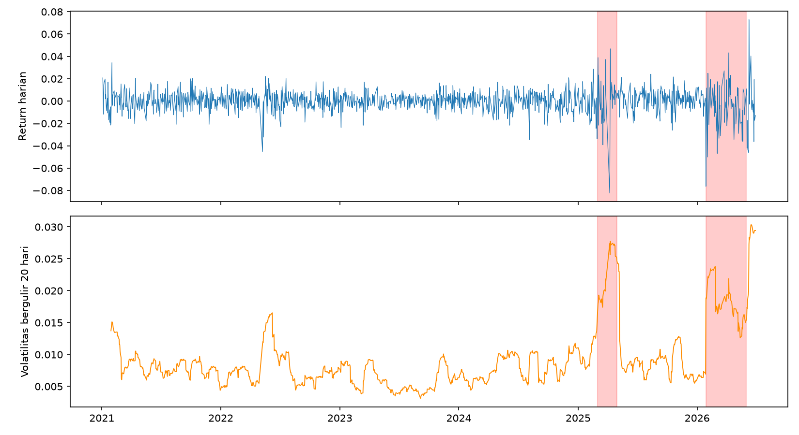 | 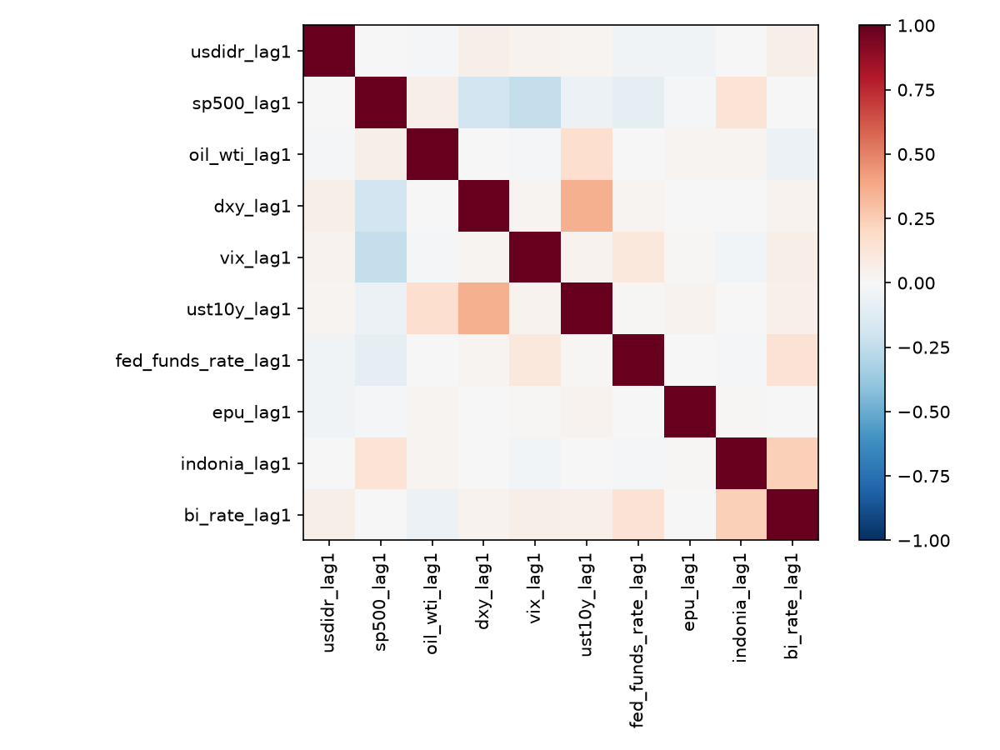 |
| Return harian & volatilitas bergulir 20-hari, dua episode volatilitas tinggi ditandai (ilustratif) | Heatmap korelasi 10 variabel makro — semua VIF 1,0–1,2, tidak ada multikolinearitas |

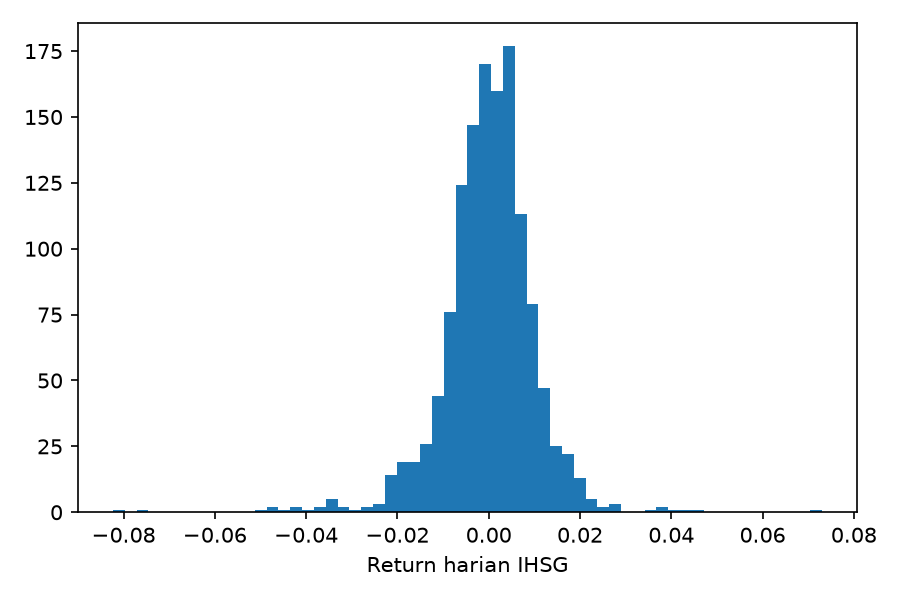

Distribusi return harian IHSG — fat-tailed, konsisten dengan penolakan normalitas (Jarque-Bera p=0,0000).

## Performa Model

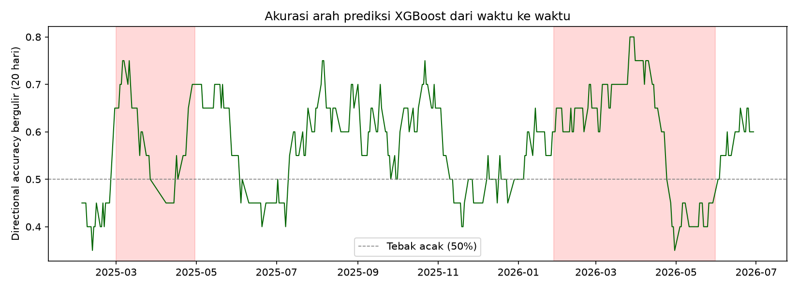

Akurasi arah bergulir 20-hari — melonjak di awal setiap episode volatilitas tinggi, menurun di puncaknya.

| | |
|---|---|
| 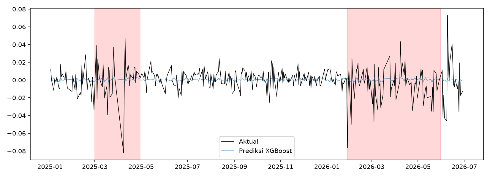 | 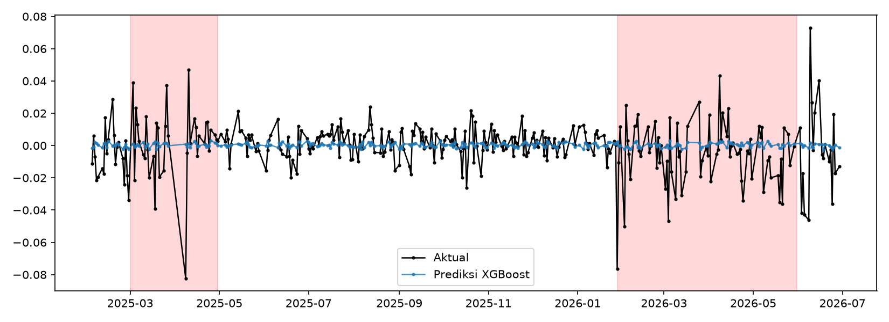 |

## Interpretasi SHAP (model regresi)

| | | |
|---|---|---|
| 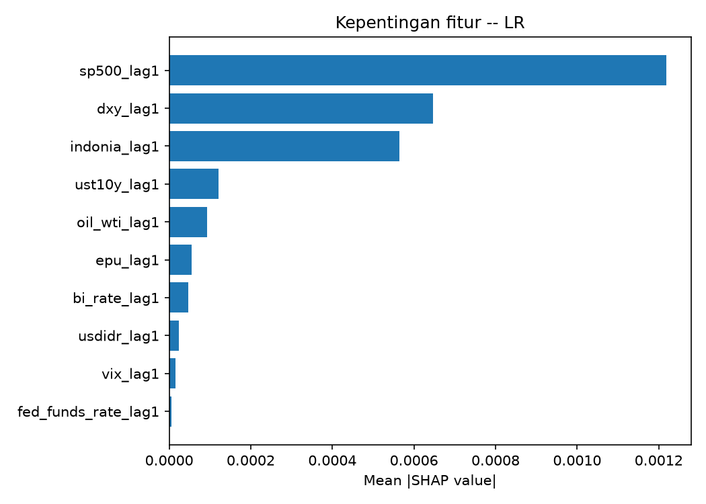 | 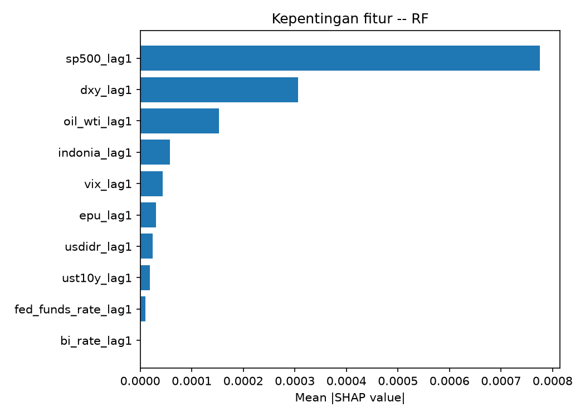 | 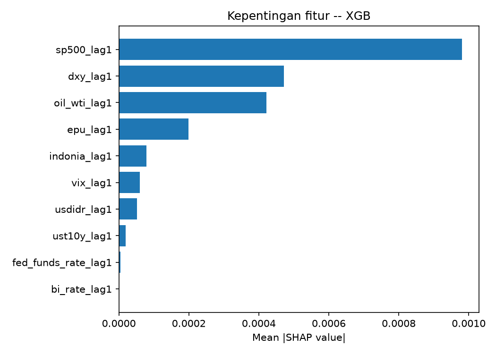 |

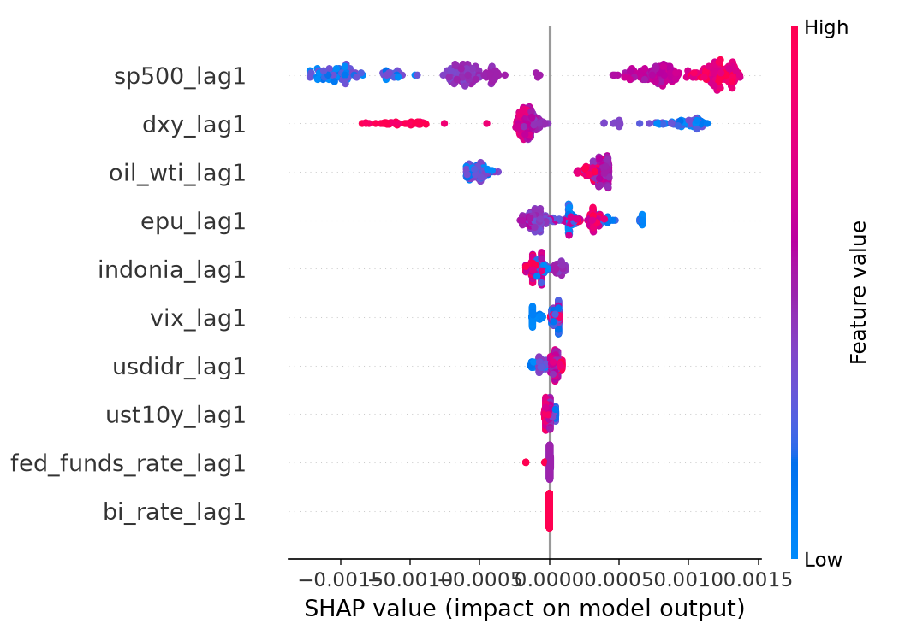

SHAP summary plot (arah pengaruh) — S&P 500 tinggi → SHAP positif; DXY tinggi → SHAP negatif, konsisten di seluruh model.

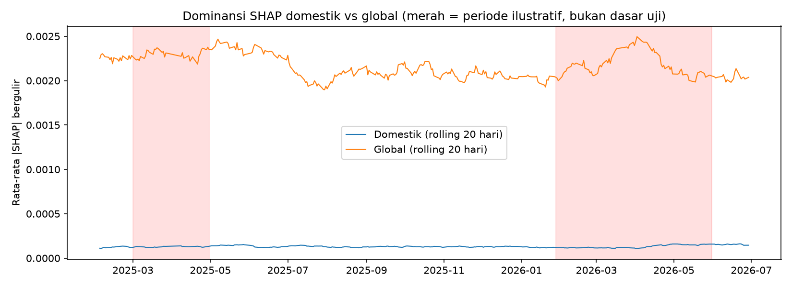

Dominansi global konsisten 15–20× lebih tinggi dari domestik sepanjang periode uji (model regresi).

## Interpretasi SHAP (model klasifikasi)

| | | |
|---|---|---|
| 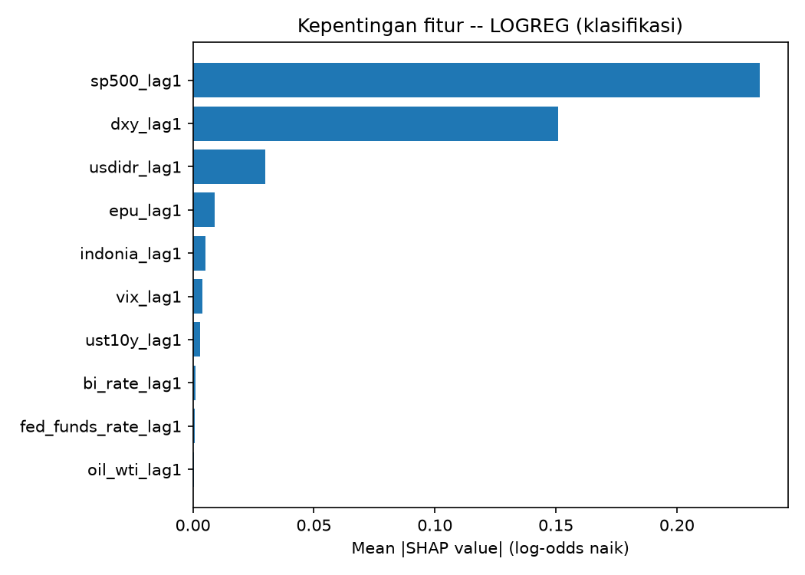 | 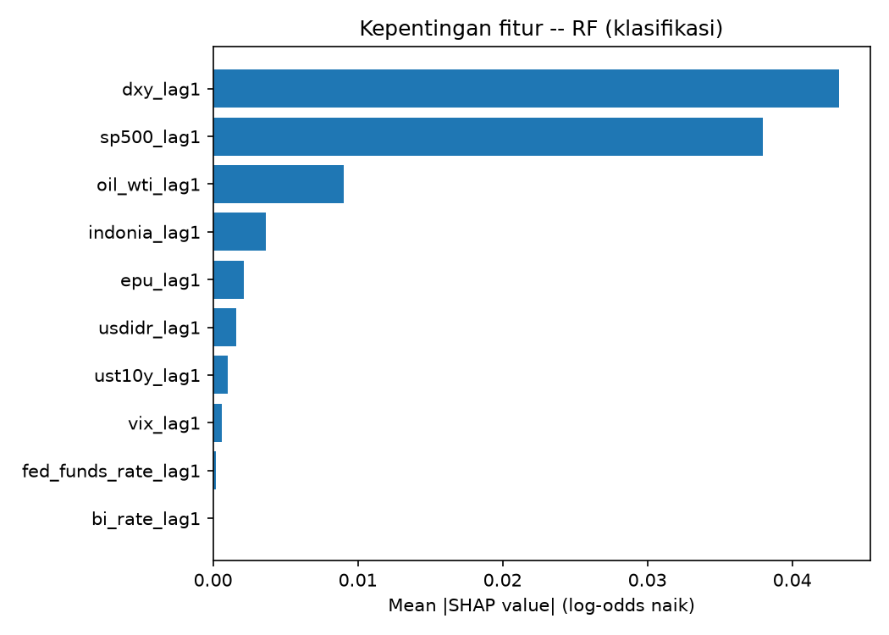 | 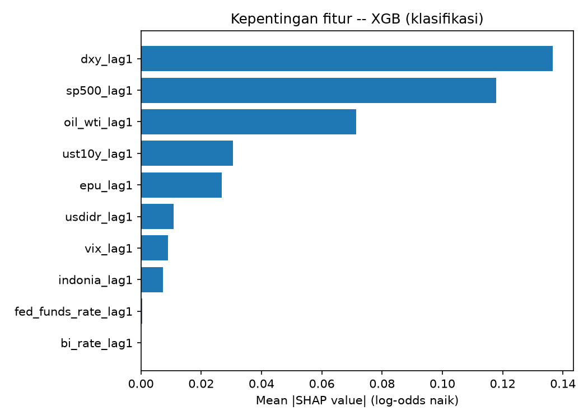 |

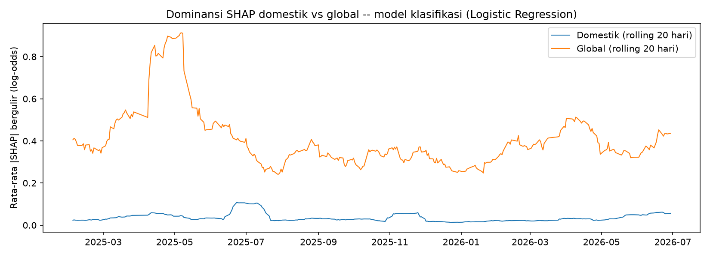

Pada model klasifikasi, dominansi global-domestik **bergeser signifikan** antar rezim volatilitas (Mann-Whitney U p=0,023) — berbeda dari model regresi (p=0,704).

## ARIMAX & LSTM

| | |
|---|---|
|  |  |
|  |  |

Kurva `val_loss` LSTM naik setelah epoch ke-5 (early stopping di epoch 15) — bukti visual overfitting pada data latih yang kecil (808 sequence).

## Perbandingan Seluruh Model


---

## Hasil Utama

### Uji Signifikansi (OLS + Wald)

| RQ | Hipotesis | F | p-value | Simpulan |
|---|---|---|---|---|
| RQ1 | Domestik = 0 | 0,625 | 0,599 | Tidak signifikan |
| RQ2 | Global = 0 | 8,501 | 3,3×10⁻¹⁰ | **Signifikan** |
| RQ3 | Domestik = Global | 2,489 | 0,115 | Tidak signifikan |

Individual signifikan (α=0,05): **S&P 500** (β=+0,0023, p<0,001), **DXY** (β=−0,0010, p=0,005).

### Perbandingan Akurasi Arah — Seluruh Model

| Model | Akurasi | k/n | p-binomial | Signifikan vs tebak acak? |
|---|---|---|---|---|
| Naif (tebak 50%) | 50,0% | — | — | — |
| ARIMAX(0,0,1) | 55,0% | 191/347 | 0,034 | Ya |
| LSTM (klasifikasi, lookback 20 hari) | 55,3% | 192/347 | 0,027 | Ya |
| XGBoost (regresi → tanda) | 57,1% | 198/347 | 0,005 | Ya |
| Random Forest (klasifikasi) | 58,5% | 203/347 | 0,001 | Ya |
| **Logistic Regression (klasifikasi)** | **59,9%** | **208/347** | **0,0001** | **Ya — terbaik** |

### Segmentasi Volatilitas (XGBoost, regresi)

| Rezim | n | RMSE | Akurasi Arah |
|---|---|---|---|
| Volatilitas tinggi | 173 | 0,019883 | 58,4% |
| Volatilitas rendah | 174 | 0,008446 | 55,7% |

### Interpretasi SHAP

- **S&P 500 dan DXY** konsisten menjadi dua fitur teratas di seluruh model (LR, RF, XGBoost), baik regresi maupun klasifikasi.
- **BI Rate = 0% feature importance** di Random Forest dan XGBoost (Gini & gain) — tidak pernah dipakai sebagai basis split.
- Dominansi SHAP global-domestik **konstan** antar rezim volatilitas pada model regresi (Mann-Whitney U, p=0,704, effect size ≈0), tetapi **bergeser signifikan** pada model klasifikasi (p=0,023, r=−0,141).
- Ablation study: fitur domestik saja → performa **lebih buruk dari baseline naif**; fitur global saja → mendekati/melampaui model penuh.

---

## Struktur Repo

```
.
├── data_raw/                     # Data mentah hasil akuisisi (FRED, BI, pasar global, EPU)
├── data_processed/
│   └── dataset_final.csv         # Dataset final: 1.316 baris x 11 kolom
├── src/
│   ├── hari3a_eda.py             # EDA + uji ADF
│   ├── hari3b_modeling.py        # OLS + asumsi klasik + tuning ML regresi
│   ├── hari4_shap.py             # SHAP 3 model, rolling dominansi, Mann-Whitney U, ablation, uji binomial
│   ├── hari5_klasifikasi_autoregresif.py   # Eksperimen reformulasi klasifikasi + fitur AR
│   ├── hari5b_shap_klasifikasi.py          # SHAP untuk model klasifikasi
│   ├── hari6_arimax_v2.py        # ARIMAX dengan pengecekan konvergensi
│   ├── hari7_lstm.py             # LSTM sequence-based (lookback 20 hari)
│   ├── hari8_perbandingan_model.py         # Perbandingan visual seluruh model
│   ├── viz_arimax.py             # Visualisasi tambahan ARIMAX (append setelah hari6)
│   └── viz_lstm.py               # Visualisasi tambahan LSTM (append setelah hari7)
├── outputs/
│   ├── figures/                  # Seluruh PNG hasil (EDA, SHAP, perbandingan model)
│   ├── tables/                   # Seluruh CSV hasil (uji statistik, performa model)
│   ├── models/                   # Model regresi tersimpan (.joblib)
│   └── models_klasifikasi/       # Model klasifikasi tersimpan (.joblib)
├── diagram1_pipeline.png         # Diagram arsitektur pipeline penelitian
├── diagram2_arsitektur_model.png # Diagram arsitektur XGBoost & ARIMAX
└── README.md
```

> Struktur di atas asumsi berdasarkan urutan pengembangan — **cek ulang terhadap `outputs/` aktual di repo**, terutama apakah semua file `.joblib` benar-benar ter-push (file besar kadang perlu Git LFS atau dikecualikan via `.gitignore`).

---

## Cara Menjalankan

**Rekomendasi: Google Colab** (lebih cepat untuk tuning hyperparameter & LSTM dengan GPU).

```python
from getpass import getpass
token = getpass("Paste GitHub token: ")
!git clone https://{token}@github.com/USERNAME/REPO.git
%cd REPO
!pip install -q -r requirements.txt   # atau: pip install pandas numpy scipy statsmodels scikit-learn xgboost shap tensorflow joblib matplotlib
```

Jalankan skrip **berurutan** (tiap tahap bergantung pada output tahap sebelumnya — model & data tersimpan di `outputs/`):

```
hari3a_eda.py → hari3b_modeling.py → hari4_shap.py → hari5b_shap_klasifikasi.py
→ hari6_arimax_v2.py → hari7_lstm.py → hari8_perbandingan_model.py
```

Ganti `USERNAME/REPO` sesuai path repo asli.

---

## Metodologi Singkat

1. **Stasioneritas**: seluruh 11 variabel diuji ADF sebelum estimasi — semua stasioner (p<0,05), termasuk BI Rate (ADF=−4,209; p=0,0006).
2. **Asumsi klasik OLS**: Breusch-Pagan (heteroskedastisitas → dikoreksi HC3), Jarque-Bera (non-normal, fat-tailed — wajar untuk return finansial), Durbin-Watson (2,043, tidak ada autokorelasi), VIF (1,0–1,2, tidak ada multikolinearitas).
3. **Walk-forward split**: mencegah look-ahead bias; tuning hyperparameter via `TimeSeriesSplit` (5-fold), bukan K-fold acak.
4. **Definisi rezim volatilitas**: median volatilitas bergulir 20 hari pada data uji — **bukan** tanggal kalender manual, untuk menghindari bias pemilihan periode.
5. **Periode krisis ilustratif** (ditandai di grafik, bukan dasar uji statistik): Maret–April 2025 (tarif AS) dan Januari–Juni 2026 (eskalasi geopolitik, intervensi kebijakan BI/MSCI).

---

## Keterbatasan

- Rasio sinyal-terhadap-derau rendah pada data return harian (R² OLS = 0,064) — konsisten hipotesis pasar efisien bentuk lemah, bukan indikasi kegagalan model.
- LSTM dan ARIMAX **tidak** mengalahkan pendekatan ML tabular (klasifikasi Logistic Regression tetap terbaik) — dilaporkan apa adanya, bukan disembunyikan.
- Penambahan fitur autoregresif (lag return IHSG sendiri) terbukti **menurunkan** signifikansi model tree-based — momentum jangka pendek tidak cukup kuat dieksploitasi.

---

## Status

- [x] Akuisisi & pra-pemrosesan data
- [x] OLS + uji asumsi + Wald test (RQ1–RQ3)
- [x] Tuning & evaluasi ML (regresi + klasifikasi)
- [x] SHAP + rolling-window + Mann-Whitney U + ablation + uji binomial
- [x] ARIMAX (dengan pengecekan konvergensi)
- [x] LSTM
- [ ] BAB 2 (Tinjauan Pustaka) — belum ditulis formal
- [ ] BAB 3 (Metodologi) — belum ditulis formal (draf naratif tersedia)
- [ ] BAB 4 — hasil eksperimen lengkap, narasi belum disusun penuh
- [ ] Submit paper ke JAIC

---

## Referensi Utama

- Lundberg & Lee (2017) — dasar matematis SHAP
- Takefuji (2025) — bukti gain importance XGBoost *inconsistent*, justifikasi pemilihan SHAP
- Koesrindartoto dkk. (2024) — investor asing vs domestik di Indonesia
- Sethapramote dkk. (2023) — spillover pasar ASEAN saat krisis
- Yu & Choi (2023) — preseden SHAP-XGBoost lokal vs global (domain berbeda)

Daftar pustaka lengkap (25 referensi, format IEEE) tersedia di naskah paper.
